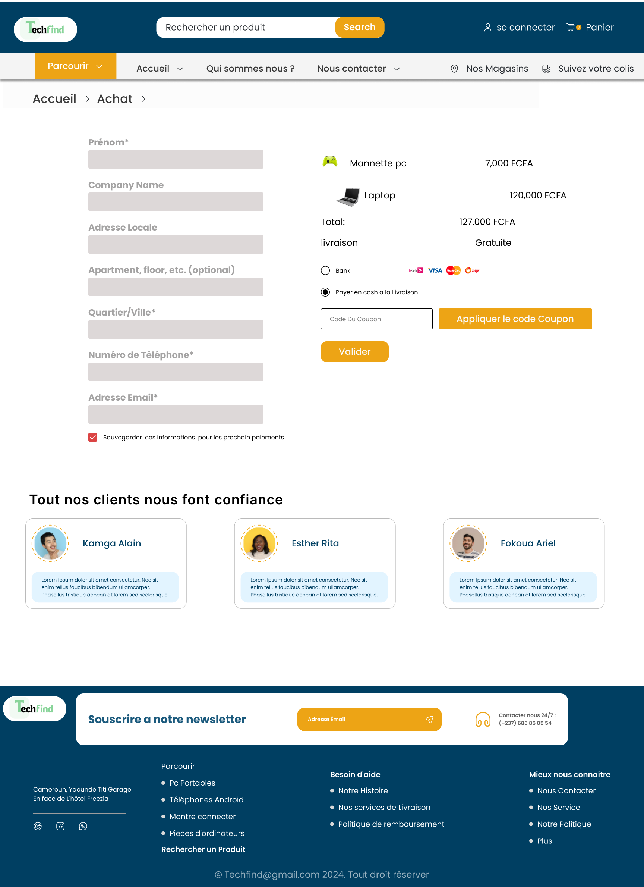
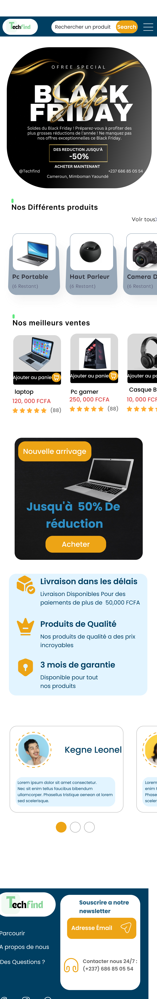

<h1 align="center">
    
</h1>

<p align="center">
  <strong>Boutique e-commerce high-tech : moderne, responsive et sécurisée.</strong><br/>
  Vente d'ordinateurs, téléphones et matériel informatique au Cameroun 🇨🇲
</p>

<p align="center">
  
  
  
  
  
</p>

---

## À propos du projet

**Techfind** est un projet e-commerce que j'ai conçu de bout en bout, de l'idée à la mise en
œuvre. Mon objectif : livrer une véritable boutique en ligne, pas une simple démo, pensée
comme le ferait une équipe professionnelle : **interface épurée et responsive, code propre et
commenté, et surtout une attention constante portée à la sécurité**.

Ce dépôt regroupe l'aboutissement d'une démarche complète : réflexion, conception, design,
modélisation, puis développement.

## 🧭 Ma démarche de conception

J'ai construit ce projet étape par étape, en traitant d'abord la réflexion et le design avant
d'écrire la moindre ligne de code :

1. **Identité visuelle** : j'ai créé le logo Techfind sous **Adobe Photoshop**, ainsi que la
   direction graphique (couleurs, typographie).
2. **Maquettage** : j'ai réalisé les maquettes **web et mobile sur Figma** (voir les liens en bas
   de page), écran par écran.
3. **Analyse** : j'ai modélisé le projet avec des **diagrammes UML** et défini les **cas
   d'utilisation**, afin de cadrer les fonctionnalités attendues.
4. **Parcours utilisateur (UX)** : je me suis mis à la place du client : comment il arrive sur le
   site, navigue dans le catalogue, ajoute au panier et finalise sa commande, pour rendre
   l'expérience fluide et intuitive.
5. **Conception de la base de données** : j'ai défini les **entités** (utilisateurs, produits,
   catégories, commandes…) et les relations, puis créé la base.
6. **Sécurité** : j'ai réfléchi aux risques en amont (validation des données, protection des mots
   de passe, recalcul des montants côté serveur…) plutôt que de les traiter après coup.
7. **Développement** : j'ai ensuite implémenté le site avec une stack moderne, en **m'appuyant sur
   l'IA (Claude Code) pour avancer efficacement**, tout en gardant la maîtrise de l'architecture,
   des choix techniques et de la sécurité.

## 🖼️ Aperçu

<p align="center">
  
</p>
<p align="center">
  
  
</p>
<p align="center">
  
  
</p>

## ✨ Fonctionnalités

- **Catalogue** dynamique (produits & catégories servis depuis la base de données)
- **Recherche** et **filtres** (catégorie, disponibilité, tri) synchronisés avec l'URL
- **Fiche produit** détaillée : variantes (couleur/taille), quantité, produits similaires
- **Panier** persistant (survit au rafraîchissement) avec mise à jour en temps réel
- **Tunnel de commande** avec **recalcul du montant côté serveur** et gestion du stock
- **Comptes utilisateurs** : inscription, connexion, profil, historique des commandes
- **Pages** : accueil, produits, fiche produit, panier, paiement, compte, à propos, contact
- **100% responsive** (mobile → desktop) avec menu et filtres en tiroir sur mobile
- **Accessibilité** soignée (HTML sémantique, navigation clavier, contrastes)

## 🛠️ Stack technique

| Domaine        | Technologie                                             |
| -------------- | ------------------------------------------------------- |
| Framework      | **Next.js 16** (App Router) + **React 19**              |
| Langage        | **TypeScript** (mode strict)                            |
| Styles         | **Tailwind CSS v4** (design tokens centralisés)         |
| Base de données| **Prisma ORM** + **SQLite** (commutable PostgreSQL)     |
| Authentification | Sessions maison + **bcrypt** (cookie httpOnly)        |
| Validation     | **Zod** (côté serveur)                                  |
| Icônes         | lucide-react                                            |

## 🚀 Démarrage rapide

**Prérequis :** Node.js 18+ et npm.

```bash
# 1. Installer les dépendances
npm install

# 2. Configurer l'environnement
cp .env.example .env        # (Windows : copy .env.example .env)

# 3. Créer la base de données et la remplir de produits de démonstration
npm run db:push
npm run db:seed

# 4. Lancer le serveur de développement
npm run dev
```

Le site est alors disponible sur **http://localhost:3000**.

## 📜 Scripts npm

| Script            | Description                                             |
| ----------------- | ------------------------------------------------------- |
| `npm run dev`     | Serveur de développement                                |
| `npm run build`   | Build de production                                     |
| `npm run start`   | Lance le build de production                            |
| `npm run lint`    | Analyse du code (ESLint)                                |
| `npm run db:push` | Applique le schéma Prisma à la base                     |
| `npm run db:seed` | Remplit la base (catégories, produits, vignettes)       |
| `npm run db:studio` | Ouvre Prisma Studio (explorer la base visuellement)   |
| `npm run db:reset`| Réinitialise et re-remplit la base                      |

## 📁 Structure du projet

```
techfind/
├─ prisma/
│  ├─ schema.prisma        # Modèle de données (tables & relations)
│  └─ seed.ts              # Données de démonstration + vignettes
├─ src/
│  ├─ app/                 # Routes (App Router)
│  │  ├─ (shop)/           # Pages avec header/footer (accueil, produits, panier…)
│  │  ├─ connexion/        # Pages d'authentification (plein écran)
│  │  └─ inscription/
│  ├─ components/          # Composants réutilisables
│  │  ├─ ui/               # Briques de base (Button, Input, Rating…)
│  │  ├─ layout/           # Header, Footer, Newsletter
│  │  ├─ product/          # ProductCard, filtres, carrousels…
│  │  ├─ account/          # Formulaire de profil
│  │  └─ auth/             # Coque et boutons d'authentification
│  ├─ context/             # CartContext (panier)
│  └─ lib/                 # Logique métier
│     ├─ actions/          # Server Actions (auth, commande, contact, profil)
│     ├─ auth.ts           # Sessions + hachage des mots de passe
│     ├─ data.ts           # Accès aux données (lecture)
│     ├─ validation.ts     # Schémas Zod
│     └─ utils.ts          # Formatage (prix FCFA), helpers
└─ CLAUDE.md               # Conventions & règles de développement du projet
```

## 🔒 Sécurité

La sécurité a été pensée dès la conception :

- **Mots de passe hachés** avec bcrypt : jamais stockés en clair.
- **Sessions** via un jeton aléatoire opaque + cookie `httpOnly` (inaccessible au JavaScript).
- **Validation systématique côté serveur** (Zod) de toutes les entrées utilisateur.
- **Montants recalculés côté serveur** au paiement : les prix envoyés par le navigateur ne sont
  jamais pris pour argent comptant.
- **En-têtes de sécurité** (CSP, anti-clickjacking, nosniff…) configurés dans `next.config.ts`.
- **Aucun secret dans le code** : tout passe par des variables d'environnement (`.env` ignoré par git).
- Requêtes **paramétrées** via Prisma (protection contre les injections SQL).

> 🔧 Pistes d'amélioration pour une mise en production à grande échelle : limitation du taux de
> requêtes (rate-limiting) sur la connexion, CSP à base de *nonce*, et intégration d'un prestataire
> de paiement (Stripe / Mobile Money) : les points d'intégration sont documentés dans le code.

## 🎨 Personnalisation

- **Couleurs & typographie** : `src/app/globals.css` (bloc `@theme`). Modifiez une valeur, elle se
  répercute sur tout le site.
- **Produits & catégories** : `prisma/seed.ts`, puis `npm run db:seed`.
- **Coordonnées / liens du footer** : `src/lib/site.ts`.
- **Vraies photos produit** : remplacez les fichiers `public/products/<slug>.svg`.

## ☁️ Déploiement

Le projet se déploie facilement sur **Vercel**. Pour la production, il est recommandé de passer de
SQLite à **PostgreSQL** :

1. Dans `prisma/schema.prisma`, remplacez `provider = "sqlite"` par `provider = "postgresql"`.
2. Renseignez `DATABASE_URL` (URL PostgreSQL) dans les variables d'environnement.
3. Lancez `npm run db:push` puis `npm run db:seed`.

## 🎯 Maquettes Figma

- **Version Web** : [Design](https://www.figma.com/design/rcla98opo3CgOLG0CwOOwm/Techfind?node-id=0-1) · [Prototype](https://www.figma.com/proto/rcla98opo3CgOLG0CwOOwm/Techfind?node-id=0-1)
- **Version Mobile** : [Design](https://www.figma.com/design/Y7qbrTjUq3EZxPIskdwhFs/Mobile-Techfind?node-id=0-1) · [Prototype](https://www.figma.com/proto/Y7qbrTjUq3EZxPIskdwhFs/Mobile-Techfind?node-id=0-1)

## 👤 Auteur

**Kenmeugne Calixte** : conception, design (Photoshop & Figma), modélisation et développement.

---

<p align="center"><sub>Projet réalisé avec passion. Développement assisté par IA.</sub></p>
