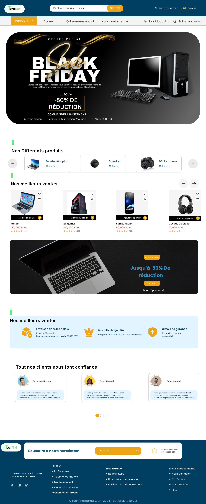
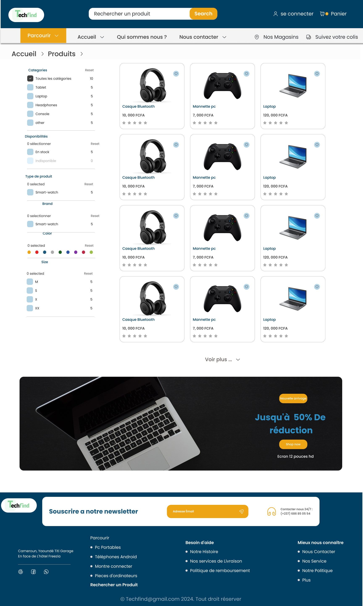
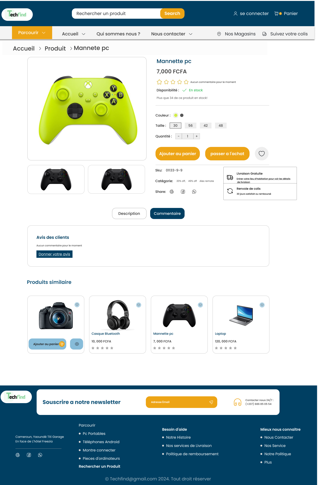

<h1 align="center">
  
</h1>

<p align="center">
  <strong>Boutique e-commerce high-tech : moderne, responsive et sécurisée.</strong><br/>
  Vente d'ordinateurs, téléphones et matériel informatique au Cameroun 🇨🇲
</p>

<p align="center">
  
  
  
  
</p>

---

## À propos du projet

**Techfind** est un projet e-commerce que j'ai conçu de bout en bout, de l'idée à la mise en
œuvre. Mon objectif : livrer une véritable boutique en ligne, pas une simple démo, pensée
comme le ferait une équipe professionnelle : **interface épurée et responsive, code propre et
commenté, et une attention constante portée à la sécurité et à l'expérience utilisateur**.

> 🌐 **Démo en ligne** : _déployable en un clic sur Vercel_ (voir la section [Déploiement](#-déploiement)).
> Cette version vitrine permet de tester librement le parcours d'achat.

## 🧭 Ma démarche de conception

J'ai construit ce projet étape par étape, en traitant d'abord la réflexion et le design avant
d'écrire la moindre ligne de code :

1. **Identité visuelle** : j'ai créé le logo Techfind sous **Adobe Photoshop**, ainsi que la
   direction graphique (couleurs, typographie).
2. **Maquettage** : j'ai réalisé les maquettes **web et mobile sur Figma** (liens en bas de page),
   écran par écran.
3. **Analyse** : j'ai modélisé le projet avec des **diagrammes UML** et défini les **cas
   d'utilisation** pour cadrer les fonctionnalités.
4. **Parcours utilisateur (UX)** : je me suis mis à la place du client : arrivée sur le site,
   navigation dans le catalogue, ajout au panier, finalisation de la commande, pour une
   expérience fluide et intuitive.
5. **Conception de la base de données** : j'ai défini les **entités** (utilisateurs, produits,
   catégories, commandes…) et leurs relations.
6. **Sécurité** : j'ai réfléchi aux risques en amont (validation des données, protection des mots
   de passe, recalcul des montants côté serveur…) plutôt que de les traiter après coup.
7. **Développement** : j'ai implémenté le site avec une stack moderne, en m'appuyant sur l'IA pour
   avancer efficacement, tout en gardant la maîtrise de l'architecture, des choix techniques et de
   la sécurité.

## 🖼️ Aperçu

<p align="center">
  
</p>
<p align="center">
  
  
</p>

## ✨ Fonctionnalités

- **Catalogue** de produits avec de vraies photos, catégories et mises en avant
- **Recherche** et **filtres** (catégorie, disponibilité, tri) synchronisés avec l'URL
- **Fiche produit** détaillée : variantes (couleur/taille), quantité, produits similaires
- **Panier** persistant (survit au rafraîchissement) avec mise à jour en temps réel
- **Tunnel de commande** avec **validation et recalcul du montant côté serveur**
- **Comptes utilisateurs** : inscription, connexion, profil, historique des commandes
- **Page « Nos magasins »** (boutiques Yaoundé & Douala)
- **100% responsive** (mobile → desktop) avec menu et filtres en tiroir sur mobile
- **Accessibilité** soignée (HTML sémantique, navigation clavier, contrastes)

## 🧱 Deux versions

| Branche | Description |
| ------- | ----------- |
| **`main`** (celle-ci) | **Version démo** déployable sur Vercel *sans base de données* : catalogue statique, panier et comptes gérés côté navigateur. Idéale pour tester le design et le parcours. |
| **`full-stack`** | Version complète avec **base de données Prisma**, **authentification réelle** (bcrypt + sessions), commandes persistées. |

## 🛠️ Stack technique

| Domaine        | Technologie                                             |
| -------------- | ------------------------------------------------------- |
| Framework      | **Next.js 16** (App Router) + **React 19**              |
| Langage        | **TypeScript** (mode strict)                            |
| Styles         | **Tailwind CSS v4** (design tokens centralisés)         |
| Validation     | **Zod** (côté serveur)                                  |
| Données (démo) | Catalogue statique • panier & comptes en `localStorage` |
| Icônes         | lucide-react                                            |

## 🚀 Démarrage rapide

**Prérequis :** Node.js 18+ et npm.

```bash
# 1. Installer les dépendances
npm install

# 2. Lancer le serveur de développement
npm run dev
```

Le site est disponible sur **http://localhost:3000**. Aucune configuration ni base de données n'est
nécessaire pour la version démo.

## 📜 Scripts npm

| Script          | Description                    |
| --------------- | ------------------------------ |
| `npm run dev`   | Serveur de développement       |
| `npm run build` | Build de production            |
| `npm run start` | Lance le build de production   |
| `npm run lint`  | Analyse du code (ESLint)       |

## 📁 Structure du projet

```
techfind/
├─ public/products/        # Photos des produits
├─ src/
│  ├─ app/                 # Routes (App Router)
│  │  ├─ (shop)/           # Pages avec header/footer (accueil, produits, panier…)
│  │  ├─ connexion/        # Pages d'authentification (plein écran)
│  │  └─ inscription/
│  ├─ components/          # Composants réutilisables (ui/, layout/, product/, …)
│  ├─ context/             # CartContext (panier) + AuthContext (comptes)
│  └─ lib/                 # Logique métier
│     ├─ catalog.ts        # 👈 Catalogue : produits, catégories, magasins
│     ├─ data.ts           # Accès aux données
│     ├─ validation.ts     # Schémas Zod
│     └─ actions/          # Server Actions (commande, contact)
```

## 🔒 Sécurité

La sécurité a été pensée dès la conception :

- **Validation systématique côté serveur** (Zod) de toutes les entrées utilisateur.
- **Montant de la commande recalculé côté serveur** : les prix envoyés par le navigateur ne sont
  jamais pris pour argent comptant.
- **En-têtes de sécurité** (CSP, anti-clickjacking, nosniff…) configurés dans `next.config.ts`.
- **Aucun secret dans le code.** Les mots de passe ne sont jamais stockés en clair (empreinte en
  démo ; **bcrypt** côté serveur dans la version full-stack).

## 🎨 Personnalisation

- **Produits, catégories, magasins** : `src/lib/catalog.ts` (photos dans `public/products/`).
- **Couleurs & typographie** : `src/app/globals.css` (bloc `@theme`).
- **Coordonnées / liens du footer** : `src/lib/site.ts`.

## ☁️ Déploiement

Déploiement **Vercel** en un clic, sans configuration :

1. Importez le dépôt sur [vercel.com/new](https://vercel.com/new).
2. Laissez les réglages par défaut (Next.js détecté automatiquement).
3. Cliquez sur **Deploy**. 🎉

## 🎯 Maquettes Figma

- **Version Web** : [Design](https://www.figma.com/design/rcla98opo3CgOLG0CwOOwm/Techfind?node-id=0-1) · [Prototype](https://www.figma.com/proto/rcla98opo3CgOLG0CwOOwm/Techfind?node-id=0-1)
- **Version Mobile** : [Design](https://www.figma.com/design/Y7qbrTjUq3EZxPIskdwhFs/Mobile-Techfind?node-id=0-1) · [Prototype](https://www.figma.com/proto/Y7qbrTjUq3EZxPIskdwhFs/Mobile-Techfind?node-id=0-1)

## 👤 Auteur

**Kenmeugne Calixte** : conception, design (Photoshop & Figma), modélisation et développement.

---

<p align="center"><sub>Projet réalisé avec passion. Développement assisté par IA.</sub></p>
